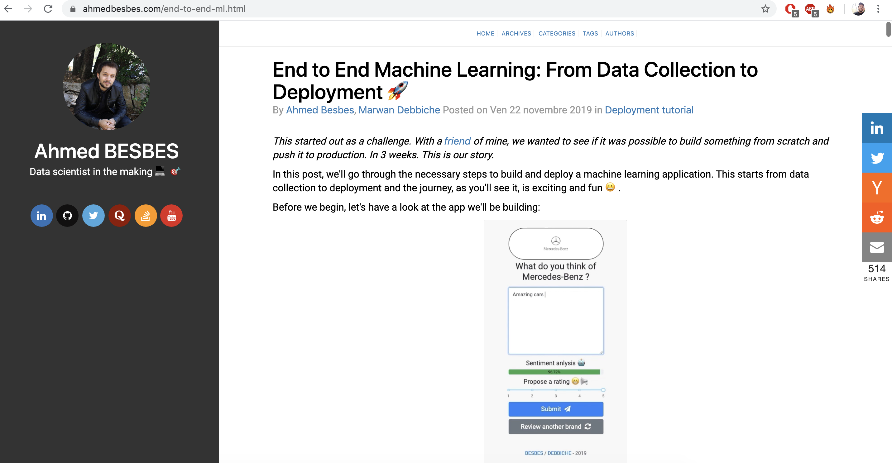
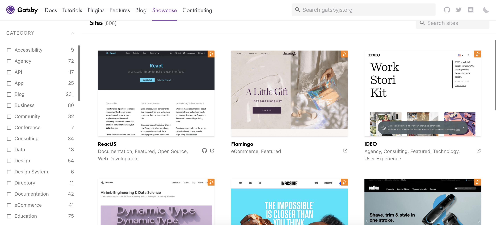
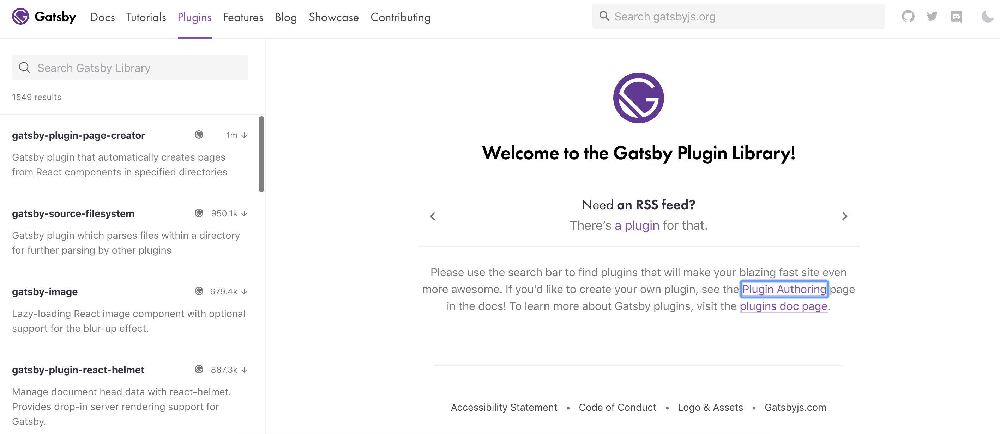
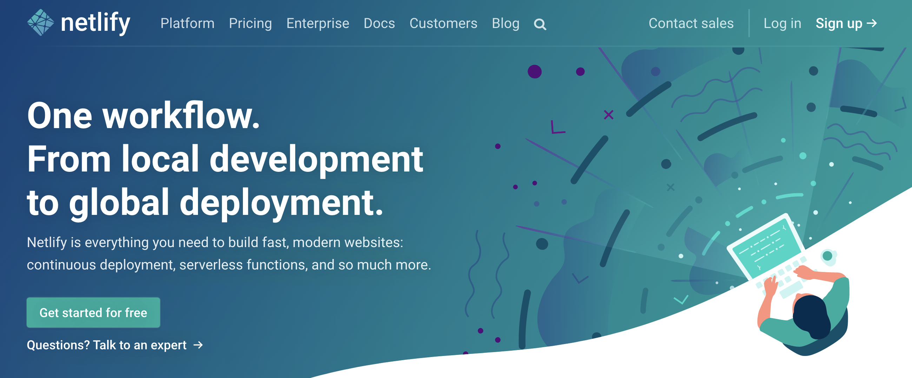

Happy new year 🎉 </br>
I hope you've all enjoyed some quality time with family and friends and prepared for some resolutions for the new year.

As for me, one of the first things I wanted to accomplish this year was the complete redesign of my blog. This one was built using the <a target='_blank' href="https://docs.getpelican.com/en/stable/">Pelican</a> python-based static site generator combined with the <a target="_blank" href="https://github.com/alexandrevicenzi/Flex">Flex</a> theme.

All in all, it emcompassed interesting features like mobile responsiveness and plugins for Disqus, AddThis and Google Analytics.</br>
And most importantly, it easily integrated with Markdown files which was convenient for post writing.



> Everything was ok, until I noticed some problems ...

### Slow loading web pages ⌛

As my posts were getting longer, the loading time kept increasing. While this was in general not a problem on desktop view, the mobile one suffered a lot from it. This impacted a large part of my audience who was primarily using mobile devices.

### A limited theme template 🤔

The template I was using didn't allow me to showcase personal projects and open source work I was developing besides of my blog posts. Adding new pages was not easy either. In fact, I had to dive inside the html code of the theme and tweak it to make it meet my needs. I found it tedious to have the logic of the theme separated from the engine of the blog.

### Some code highlighting issues ❌

Embedding code snippets is an important part of my posts. I unfortunately noticed a frustrating rendreing problem that appears on mobile devices such as the wrap of long lines of codes. </br> Seriously who wants to read that kind of code? 

### A limited set of plugins 🤷‍♂️

Pelican has various plugins but some of them are obsolete or work only with a specific version of Pelican and some functionalities are missing.

---

So I started searching for an alternative to Pelican. </br>
What I had in mind  was a framework that'd allow me to build fast-loading and responsive pages while maintaining a great level of customization.

That's when I heard about Gatsby:


> Gatsby is a free and open source framework based on React that helps developers build blazing fast websites and apps - *gatsbyjs.org*

I think the official description sums it up very well. Besides here's what made me also switch to Gatsby:

- It's built on top of the latest web technologies such as React.js and Webpack: building a new portfolio was therefore an opportunity to learn new front-end frameworks
- Gatsby can connect to a variety of data sources including Markdown files, APIs, databases...
- Gatsby makes site deployment very easy by building your site as static files in the `public` folder which can afterward be pushed to Github, Netlify or Amazon Amplify
- It only loads the critical HTML, CSS, JS it needs to render the content of the website so that clicking seems very fast

We can go on and on, but the only way to convince yourself is by trying it out, right?


## Getting started with Gatsby

My goal is not to give you a thorough tutorial on how to use Gatsby: there are in fact tons of great resources on the internet. You can check the <a target="_blank" href="https://www.gatsbyjs.org/docs/">official documentation</a> for instance.

But here's some steps to quick start:

### Prepare your environment

1. Install node and npm. If you're using a Mac for instance, you can launch this command assuming you have homebrew.

```bash
brew install node
```

If you are using Windows or a Linux distribution, you can check the <a href="https://www.gatsbyjs.org/tutorial/part-zero/#-install-nodejs-and-npm" target="_blank" >documentation</a>. It's pretty straightfoward. 

2. Install Git
3. Install the Gatbsy CLI

```bash
npm install -g gatsby-cli
```

### Create a website

*This part is borrowed from the <a target="_blank" href="https://www.gatsbyjs.org/tutorial/part-zero/#create-a-gatsby-site">documentation</a>.*

Now you are ready to use the Gatsby CLI tool to create your first Gatsby site. Using the tool, you can download “starters” (partially built sites with some default configuration) to help you get moving faster on creating a certain type of site. The “Hello World” starter you’ll be using here is a starter with the bare essentials needed for a Gatsby site.

1. Open up your terminal.
2. Run gatsby new hello-world https://github.com/gatsbyjs/gatsby-starter-hello-world. (Note: Depending on your download speed, the amount of time this takes will vary. For brevity’s sake, the gif below was paused during part of the install).
3. Run `cd hello-world`.
4. Run `gatsby develop`.

That's pretty much it. Now you have a static website running locally. Try to modify its content and you'll see (after saving) your modifications being updated in real time.

### Use a pre-existing template

If you're not a front-end ninja like me, you can look up a template you like on the <a target="_blank" href="https://www.gatsbyjs.org/showcase/">showcase tab</a> of the official website.

There are tons of open-source websites and portfolios built using Gatsby.



### Gatsby Plugins

Now the most interesting part of the Gatsby framework: <a target="_blank" href="https://www.gatsbyjs.org/plugins/">Gatsby Plugin Library</a>.

If you want to extend the capabilities of your website by adding for example image responsiveness, SEO, Google Analytics, offline support, a sitemap, a robot.txt and more, here is where you can find everything you need.

The community is vibrant and the plugins and well supported. You can search about them in the search bar.



If you want to have a great SEO for your blog or your portfolio, I found this <a target="_blank" href="https://github.com/garrynsk/gatsby-seo-starter">repo</a> that enumerates a list of useful Gatsby plugins.

### Deploy 🚀

Once you're happy with your website, you can generate static files ready for deployment by running the build command at the root of your project.

```shell
gatsby build
```
This command creates a static version of your website ready to go live on the internet and residing in the `public` folder. You can either copy it to your server, push it to github pages or use a deployment and hosting service such as <a target="_blank" href="https://www.netlify.com/">Netlify</a>. I personally chose Netlify because I found that it easily automated my workflows.



The documentation is great, you can find many blog posts that walk you through the process of deploying a Gatsby site on Netlify. Here's a great <a target="_blank" href="https://www.gatsbyjs.org/docs/deploying-to-netlify/">one</a> from gatsbyjs.org and another <a target="_blank" href="https://www.netlify.com/blog/2016/02/24/a-step-by-step-guide-gatsby-on-netlify/">one</a> from netlify.com.


### Oh wait, what about the old blog ?

> What happens to your old posts?

My blog has been live since 2016 so I definitely won't throw away my old posts. Fortunately rewriting them as Markdown files in Gatsby was easy, so I did it. It was even an opportunity to better reorganize the structure of the folders.

> The url structure of the new blog is different. What happens if a user clicks on an old link?

I used **gatsby-plugin-netlify** to create permanent url redirections (with 301 HTTP code) by specifying a mapping between old an new urls. When the build command is executed, this plugin generates a **_redirects** text file at the root of the `public` folder that write this mapping and tells Netlify to execute these redirections properly. I found this solution very convenient.

Here's an example of a **_redirects** file:

```sh
# Redirects from what the browser requests to what we serve
/home              /
/blog/my-post.php  /blog/my-post
/news              /blog
/cuties            https://www.petsofnetlify.com
```

> What happens to your old Disqus comments? Will they be lost?

Hopefully not. Disqus provides a migration service called **URL Mapper** that requires manually entering a csv mapping between old and new urls.

Here's a <a target="_blank" href="https://help.disqus.com/en/articles/1717129-url-mapper">tutorial</a> that walks you through the process.


> What about Google Analytics? Do you create a new account or keep the old one?

I searched about this issue and I found a Stackoverflow <a target="_blank" href="https://stackoverflow.com/questions/21351113/how-to-keep-stats-of-changed-urls-structure-in-google-analytics">thread</a> talking about it.

The recommended solution is to do ... nothing. You just have to reuse your old GA account on your new website.

> What about your AddThis account? Do you lose your previous stats on social shares?

Sadly, yes. AddThis processes each url differently and there's no way for it to tell "this new url should be treated as this old one."

