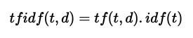

The web is full of data. You will find it in different shapes and formats; simple tabular sheets, excel files, large and unstructered NoSql databases. 

The variety of content is overwhelming: texts, logs, tweets, images, comments, likes, views, videos, news headlines. All of this is constantly produced by batch or on a real time fashion, all over the world, generating <a href="http://www.vcloudnews.com/every-day-big-data-statistics-2-5-quintillion-bytes-of-data-created-daily/"> quintillions of bytes</a> everyday. 


If you think how you could do to extract value from this large amount of data, you could qualify many applications:

- If you're a marketer, you could measure the impact of your newly released product by leveraging user's reviews posted online and applying sentiment analysis on them. You'll then catch the uninterested/unsatisfied users and understand what made them unhappy. 
- If you're into finance, you can collect stocks historical data and build statistical models to predict the future stock prices.
- If you collect your country's open data i.e growth rate, crime rate, unemployment, etc, you could build applications that might solve social problems.

In this tutorial, I'll show you how you can easily collect news feeds from 60 different data sources (Google News, The BBC, Business Insider, BuzzFeed, etc) and apply machine learning algorithms on them to automatically extract the hidden topics.


Topic mining is very helpful. It is integrated in many recommendation systems. It is present in social media monitoring tools, marketing intelligence softwares, etc.

Once you have a large volume of text data that you can't analyze by hand, topic modeling algorithms can do the job for you.


This post is structured as follow:

- **Data extraction:** I'll collect the news by requesting an external REST API called newsapi. I'll connect to this service through a python script that may run on you PC.

- **Modeling:** Once the data is collected and stored, I'll ingest it in a pandas dataframe. I'll first preprocess it using text preprocessing tokenization and the tfidf algorithm and then I'll cluster it using 2 different algorithms: K-means and Latent Dirichlet Allocation (LDA). Details below.

- **Visualization:** Finally I'll visualize the news clusters using two interactive python visualization libraries. They're called **Bokeh** and **pyldavis**. They're awesome and you'll see why.
 
Let's get started !


## 1 - Environment setup

In this tutorial, I'll be using python 2.7

One thing I recommend is downloading the Anaconda distribution for python 2.7 from this <a href="https://www.continuum.io/downloads">link</a>. This distribution wraps python with the necessary packages used in data science like Numpy, Pandas, Scipy or Scikit-learn.

For the purpose of this tutorial we'll also have to download external packages:

- tqdm (a progress bar python utility): 
pip install tqdm 
- nltk (for natural language processing): 
conda install -c anaconda nltk=3.2.2 
- bokeh (for interactive data viz): 
conda install bokeh
- gensim: 
pip install --upgrade gensim
- pyldavis (python package to visualize lda topics): 
pip install pyldavis 


To connect to the Newsapi service you'll have to create an account at https://newsapi.org/register to get a key. It's totally free. Then you'll have to put your key in the code and run the script on your own if you want to. 

All the data and scripts to run this tutorial can be found on my <a href="https://github.com/ahmedbesbes/How-to-mine-newsfeed-data-and-extract-interactive-insights-in-Python"> github</a>. Don't hesitate to fork the project and bring your modifications to it.

## 2 - Data acquisition from Newsapi.org


Well, this looks like something very handy. This avoids the tedious data scrapping that you would perform on each site separately.

Getting the latest news for a specific source like Techcrunch is as simple as sending a get request to this address:
https://newsapi.org/v1/articles?source=techcrunch&apiKey={API_KEY}

The JSON file resulting from this response is pretty straightforward:

```python
{
"status": "ok",
"source": "techcrunch",
"sortBy": "top",
-"articles": [
-{
"author": "Khaled \"Tito\" Hamze",
"title": "Crunch Report",
"description": "Your daily roundup of the biggest TechCrunch stories and startup news.",
"url": "https://techcrunch.com/video/crunchreport/",
"urlToImage": "https://tctechcrunch2011.files.wordpress.com/2015/03/tccrshowogo.jpg?w=500&h=200&crop=1",
"publishedAt": "2017-03-02T04:40:50Z"
},
-{
"author": "Kate Conger, Devin Coldewey",
"title": "Marissa Mayer forgoes bonus and equity in wake of Yahoo security incidents",
"description": "Yahoo’s board has decided that CEO Marissa Mayer will not receive her annual bonus this year, a decision linked to Yahoo’s handling of the 2014 security..",
"url": "https://techcrunch.com/2017/03/01/marissa-mayer-forgoes-bonus-and-equity-in-wake-of-yahoo-security-incidents/",
"urlToImage": "https://tctechcrunch2011.files.wordpress.com/2014/05/marissa-mayer3.jpg?w=764&h=400&crop=1",
"publishedAt": "2017-03-01T22:20:38Z"
},
-{
"author": "Matthew Lynley",
"title": "Snap values itself at nearly $24B with its IPO pricing",
"description": "Snap has given a final price for its IPO, setting the company's valuation at nearly $24 billion with a price of $17 per share, according to a report by The..",
"url": "https://techcrunch.com/2017/03/01/snap-values-itself-at-nearly-24b-with-its-ipo-pricing/",
"urlToImage": "https://tctechcrunch2011.files.wordpress.com/2016/12/8a82586a123a7429edd0ca2f65ddbeda.jpg?w=764&h=400&crop=1",
"publishedAt": "2017-03-01T19:49:15Z"
},
...
]
}
```

The **articles** object is a list of JSON files corresponding to the latest published articles. As you can see, we can not go far into the historical data to extract a large dump of articles.

One solution I came up with to get a large set of news articles was to request the address above for every source at every 5 minutes for a long period of time. As for now, the script has been running for more than two weeks.

Let's get into the code to see how to manage this data acquisition:


```python
# import packages
from __future__ import print_function
import requests
import pandas as pd
from datetime import datetime
from tqdm import tqdm
from matplotlib import pyplot as plt
```

In this post, we'll be analyzing english news sources only. 


```python
def getSources():
    source_url = 'https://newsapi.org/v1/sources?language=en'
    response = requests.get(source_url).json()
    sources = []
    for source in response['sources']:
        sources.append(source['id'])
    return sources

sources = getSources()
print('number of sources :', len(sources))
print('sources :', ', '.join(sources))

# number of sources : 60
# sources : abc-news-au, al-jazeera-english, ars-technica, associated-press, bbc-news, bbc-sport, bloomberg, breitbart-news, business-insider, business-insider-uk, buzzfeed, cnbc, cnn, daily-mail, engadget, entertainment-weekly, espn, espn-cric-info, financial-times, football-italia, fortune, four-four-two, fox-sports, google-news, hacker-news, ign, independent, mashable, metro, mirror, mtv-news, mtv-news-uk, national-geographic, new-scientist, newsweek, new-york-magazine, nfl-news, polygon, recode, reddit-r-all, reuters, talksport, techcrunch, techradar, the-economist, the-guardian-au, the-guardian-uk, the-hindu, the-huffington-post, the-lad-bible, the-new-york-times, the-next-web, the-sport-bible, the-telegraph, the-times-of-india, the-verge, the-wall-street-journal, the-washington-post, time, usa-today

```

Newsapi allows you to map each data source to its category. Let's use this information as an additional feature in our dataset. This may be useful later.


```python
def mapping():
    d = {}
    response = requests.get('https://newsapi.org/v1/sources?language=en')
    response = response.json()
    for s in response['sources']:
        d[s['id']] = s['category']
    return d
```

Let's check the category of reuters and techcrunch for example:


```python
m = mapping()
print('category of reuters:', m['reuters'])
print('category of techcrunch:', m['techcrunch'])

# category of reuters: general
# category of techcrunch: technology

```

let's see what categories we have:


```python
print('categories:', list(set(m.values())))
# categories: [u'business', u'entertainment', u'science', u'general', u'sports', u'technology']
```

The main function is getDailyNews. It will loop on each news source, request the api, extract the data and dump it to a pandas DataFrame and then export the result into csv file.

On each iteration of the loop, the csv file is updated and cleaned. Redundant lines are removed. This is handled by cleanData function.

For each article we'll collect these fields:

- author
- title
- description
- url
- urlToImage
- publishedAt

And add two other features:
- category
- scraping_date : the time at which the script runs. This will help us track the data.

Here is the complete script:

PS: since the newsapi.org has been modified, you may encounter rate limit errors. This happens when you exceed 250 requests within 6 hours. What you could do is either wait for 6 hours or sign in different accounts and launch many instances.


Full script
---


```python
import requests
from bs4 import BeautifulSoup
import pandas as pd
from datetime import datetime
from tqdm import tqdm, tqdm_notebook

def getSources():
    source_url = 'https://newsapi.org/v1/sources?language=en'
    response = requests.get(source_url).json()
    sources = []
    for source in response['sources']:
        sources.append(source['id'])
    return sources

def mapping():
    d = {}
    response = requests.get('https://newsapi.org/v1/sources?language=en')
    response = response.json()
    for s in response['sources']:
        d[s['id']] = s['category']
    return d

def category(source, m):
    try:
        return m[source]
    except:
        return 'NC'

def getDailyNews():
    sources = getSources()
    key = 'c12a5c07a7bd42edbf54d59aca007a54'
    url = 'https://newsapi.org/v1/articles?source={0}&sortBy={1}&apiKey={2}'
    responses = []
    for i, source in tqdm_notebook(enumerate(sources), total=len(sources)):
        
        try:
            u = url.format(source, 'top', key)
        except:
            u = url.format(source, 'latest', key)
        
        response = requests.get(u)
        r = response.json()
        try:
            for article in r['articles']:
                article['source'] = source
            responses.append(r)
        except:
            print('Rate limit exceeded ... please wait and retry in 6 hours')
            return None
                
    articles = list(map(lambda r: r['articles'], responses))
    articles = list(reduce(lambda x,y: x+y, articles))
    
    news = pd.DataFrame(articles)
    news = news.dropna()
    news = news.drop_duplicates()
    news.reset_index(inplace=True, drop=True)
    d = mapping()
    news['category'] = news['source'].map(lambda s: category(s, d))
    news['scraping_date'] = datetime.now()

    try:
        aux = pd.read_csv('./data/news.csv')
        aux = aux.append(news)
        aux = aux.drop_duplicates('url')
        aux.reset_index(inplace=True, drop=True)
        aux.to_csv('./data/news.csv', encoding='utf-8', index=False)
    except:
        news.to_csv('./data/news.csv', index=False, encoding='utf-8')
        
    print('Done')
    
if __name__=='__main__':
    getDailyNews()
```

Ok, now this script needs to run repetitively to collect the data. 

To do this:

I uploaded the script to my linux server at this path `/home/news/news.py`. 

Then I created a crontab schedule to tell my server to run news.py every 5 minutes (back when there were no rate limits, but you could tweak it to make it run every 6 hours). To do this: 
 - from the terminal, type `crontab -e` to edit the crontab file
 - add this line to the end of the file using nano or vim (put absolute paths for your executables): 

```bash
\*/5 \* \* \* \* /root/anaconda2/bin/python /home/article_2/news.py
```
    
  What this command tells the server is: "for every 5 minutes (\*/5) of every hour (\*) of every day of the month (\*) of every month (\*) and whatever the day of the week (\*), run the news.py script.
    
 - give your script the execution permission. Otherwise, this won't work. To do this, run:

```bash
chmod +x news.py 
```

Now that the data has been collected, we will start anlayzing it :

- We'll have a look at the dataset and inspect it
- We'll apply some preoprocessings on the texts: tokenization, tf-idf
- We'll cluster the articles using two different algorithms (Kmeans and LDA)
- We'll visualize the clusters using Bokeh and pyldavis

## 3 - Data analysis

### 3 - 1 - Data discovery


```python
import pandas as pd
pd.options.display.max_columns = 200
pd.options.mode.chained_assignment = None

from nltk.tokenize import word_tokenize, sent_tokenize
from nltk.corpus import stopwords
stop = set(stopwords.words('english'))
from string import punctuation

from collections import Counter
import re
import numpy as np

from tqdm import tqdm_notebook
tqdm_notebook().pandas()

data = pd.read_csv('./data/news.csv')
print(data.shape)
# (50126, 9)
```

The data is now ingested in a Pandas DataFrame.

Let's see what it looks like.


```python
data.head(3)
```

<div style="overflow-x: scroll"> 
<style scoped>
    .dataframe tbody tr th:only-of-type {
        vertical-align: middle;
    }

    .dataframe tbody tr th {
        vertical-align: top;
    }

    .dataframe thead th {
        text-align: right;
    }
</style>
<table border="1" class="dataframe" style="border-collapse: collapse">
  <thead>
    <tr style="text-align: right;">
      <th></th>
      <th>author</th>
      <th>description</th>
      <th>publishedAt</th>
      <th>source</th>
      <th>title</th>
      <th>url</th>
      <th>urlToImage</th>
      <th>category</th>
      <th>scraping_date</th>
    </tr>
  </thead>
  <tbody>
    <tr>
      <th>0</th>
      <td>http://www.abc.net.au/news/lisa-millar/166890</td>
      <td>In the month following Donald Trump's inaugura...</td>
      <td>2017-02-26T08:08:20Z</td>
      <td>abc-news-au</td>
      <td>Has Russia changed its tone towards Donald Trump?</td>
      <td>http://www.abc.net.au/news/2017-02-26/donald-t...</td>
      <td>http://www.abc.net.au/news/image/8300726-1x1-7...</td>
      <td>general</td>
      <td>2017-02-26 13:08:22.317772</td>
    </tr>
    <tr>
      <th>1</th>
      <td>http://www.abc.net.au/news/emily-sakzewski/768...</td>
      <td>A fasting diet could reverse diabetes and repa...</td>
      <td>2017-02-26T04:39:24Z</td>
      <td>abc-news-au</td>
      <td>Fasting diet 'could reverse diabetes and regen...</td>
      <td>http://www.abc.net.au/news/2017-02-26/fasting-...</td>
      <td>http://www.abc.net.au/news/image/8304732-1x1-7...</td>
      <td>general</td>
      <td>2017-02-26 13:08:22.317772</td>
    </tr>
    <tr>
      <th>2</th>
      <td>http://www.abc.net.au/news/jackson-vernon/7531870</td>
      <td>Researchers discover what could be one of the ...</td>
      <td>2017-02-26T02:02:28Z</td>
      <td>abc-news-au</td>
      <td>Mine pollution turning Blue Mountains river in...</td>
      <td>http://www.abc.net.au/news/2017-02-26/blue-mou...</td>
      <td>http://www.abc.net.au/news/image/8304524-1x1-7...</td>
      <td>general</td>
      <td>2017-02-26 13:08:22.317772</td>
    </tr>
  </tbody>
</table>
</div>


It's cool to have all these features. In this article, we will be mainly focusing on the description column.

Let's check the distribution of the different categories across the dataset.


```python
data.category.value_counts(normalize=True).plot(kind='bar', grid=True, figsize=(16, 9))
```


Many mixed topics are included in the "general" category.

This gives us a very superficial classificaion of the news. It doesn't tell us the underlying topics, nor the keywords and and the most relevant news per each category. All we have is a high level idea.

To get that sort of information, we'll have to process the descriptions of each article since these variables naturally carry more meanings.

Before doing that, let's focus on the news articles whose descriptions' length is higher than 140 characters (a tweet length). Shorter descriptions happen to introduce lots of noise.

Remove duplicate description columns


```python
data = data.drop_duplicates('description')
```

Remove rows with empty descriptions


```python
data = data[~data['description'].isnull()]

print(data.shape)
# (44773, 9)
```

    

Select descriptions of length between 140 and 300 characters.


```python
data = data[(data.description.map(len) > 140) & (data.description.map(len) <= 300)]
data.reset_index(inplace=True, drop=True)

print(data.shape)
# (13416, 9)
```

Let's now check the disctribution of the descriptions' lengths.


```python
data.description.map(len).hist(figsize=(15, 5), bins=100)
```


Due to memory constraints on some packages used in this tutorial, we will limit the analysis to 10000 news.

Just get some random news:


```python
data = data.sample(10000, random_state=42)
data.reset_index(inplace=True, drop=True)

data.head(2)
```


<div style="overflow-x: scroll">
<style scoped>
    .dataframe tbody tr th:only-of-type {
        vertical-align: middle;
    }

    .dataframe tbody tr th {
        vertical-align: top;
    }

    .dataframe thead th {
        text-align: right;
    }
</style>
<table border="1" class="dataframe" style="border-collapse: collapse">
  <thead>
    <tr style="text-align: right;">
      <th></th>
      <th>author</th>
      <th>description</th>
      <th>publishedAt</th>
      <th>source</th>
      <th>title</th>
      <th>url</th>
      <th>urlToImage</th>
      <th>category</th>
      <th>scraping_date</th>
    </tr>
  </thead>
  <tbody>
    <tr>
      <th>0</th>
      <td>Dan Heching</td>
      <td>One of the most refreshing things about Hamilt...</td>
      <td>2017-03-23T17:18:24Z</td>
      <td>entertainment-weekly</td>
      <td>13 Motivational Lin-Manuel Miranda Tweets to B...</td>
      <td>http://ew.com/news/2017/03/23/lin-manuel-miran...</td>
      <td>http://i0.wp.com/ewedit.files.wordpress.com/20...</td>
      <td>entertainment</td>
      <td>2017-03-23 18:35:26.152159</td>
    </tr>
    <tr>
      <th>1</th>
      <td>http://www.abc.net.au/news/6948710</td>
      <td>A former Don Dale guard tells the royal commis...</td>
      <td>2017-03-20T03:33:52Z</td>
      <td>abc-news-au</td>
      <td>Snapchat videos show Don Dale officer asking c...</td>
      <td>http://www.abc.net.au/news/2017-03-20/don-dale...</td>
      <td>http://www.abc.net.au/news/image/8369832-1x1-7...</td>
      <td>general</td>
      <td>2017-03-20 04:50:26.399490</td>
    </tr>
  </tbody>
</table>
</div>


### 3 - 2 - Text processing : tokenization

Now we start by building a tokenizer. This will, for every description:

- lowercase the text and clean it (separate function)
- break the descriptions into sentences and then break the sentences into tokens
- remove punctuation, stop words

I was used to nltk's stopwords list, then I made my own, which is richer. It's in txt file and you can find on my github account.


```python
stop_words = []

f = open('./data/stopwords.txt', 'r')
for l in f.readlines():
    stop_words.append(l.replace('\n', ''))
    
additional_stop_words = ['t', 'will']
stop_words += additional_stop_words

print(len(stop_words))
# 668
```


The two functions below are borrowed from a <a href="https://www.kaggle.com/c/jigsaw-toxic-comment-classification-challenge"> Kaggle competition </a> I participated to.

They remove non ascii characters and standardize the text (can't -> cannot, i'm -> i am). This will make the tokenization process more efficient.


```python
def _removeNonAscii(s): 
    return "".join(i for i in s if ord(i)<128)

def clean_text(text):
    text = text.lower()
    text = re.sub(r"what's", "what is ", text)
    text = text.replace('(ap)', '')
    text = re.sub(r"\'s", " is ", text)
    text = re.sub(r"\'ve", " have ", text)
    text = re.sub(r"can't", "cannot ", text)
    text = re.sub(r"n't", " not ", text)
    text = re.sub(r"i'm", "i am ", text)
    text = re.sub(r"\'re", " are ", text)
    text = re.sub(r"\'d", " would ", text)
    text = re.sub(r"\'ll", " will ", text)
    text = re.sub(r'\W+', ' ', text)
    text = re.sub(r'\s+', ' ', text)
    text = re.sub(r"\\", "", text)
    text = re.sub(r"\'", "", text)    
    text = re.sub(r"\"", "", text)
    text = re.sub('[^a-zA-Z ?!]+', '', text)
    text = _removeNonAscii(text)
    text = text.strip()
    return text
```

Integrate these two functions into a tokenizing function.


```python
def tokenizer(text):
    text = clean_text(text)    
    tokens = [word_tokenize(sent) for sent in sent_tokenize(text)]
    tokens = list(reduce(lambda x,y: x+y, tokens))
    tokens = list(filter(lambda token: token not in (stop_words + list(punctuation)) , tokens))
    return tokens
```

A new column 'tokens' can be easily created using the map method applied to the 'description' column.


```python
data['description'] = data['description'].map(lambda d: unicode(d.decode('utf-8')))
data['tokens'] = data['description'].progress_map(lambda d: tokenizer(d))
```

    


The tokenizer has been applied to each description through all rows. Each resulting value is then put into the 'tokens' column that is created after the assignment. Let's check what the tokenization looks like for the first 5 descriptions:


```python
for descripition, tokens in zip(data['description'].head(5), data['tokens'].head(5)):
    print('description:', descripition)
    print('tokens:', tokens)
    print() 
```

    description: One of the most refreshing things about Hamilton maestro Lin-Manuel Miranda is that he considers himself incredibly fortunate to have become so successful (as if his composing, writing, directing, …
    tokens: [u'refreshing', u'things', u'hamilton', u'maestro', u'lin', u'manuel', u'miranda', u'considers', u'incredibly', u'fortunate', u'successful', u'composing', u'writing', u'directing']

    description: A former Don Dale guard tells the royal commission he was joking when he asked youth detainees to perform oral sex, and goofing around in a separate incident where he encouraged a boy to eat s***.
    tokens: [u'don', u'dale', u'guard', u'tells', u'royal', u'commission', u'joking', u'asked', u'youth', u'detainees', u'perform', u'oral', u'sex', u'goofing', u'separate', u'incident', u'encouraged', u'boy', u'eat']

    description: The Federal Reserve is raising rates for just the third time since the 2008 financial crisis, cementing its shift away from stimulating growth and toward fighting inflation.
    tokens: [u'federal', u'reserve', u'raising', u'rates', u'third', u'time', u'financial', u'crisis', u'cementing', u'shift', u'stimulating', u'growth', u'fighting', u'inflation']

    description: After White House apologizes to UK for citing a conservative media report, President Trump spent Friday morning retweeting other reports from Fox, Breitbart.
    tokens: [u'white', u'house', u'apologizes', u'uk', u'citing', u'conservative', u'media', u'report', u'president', u'trump', u'spent', u'friday', u'morning', u'retweeting', u'reports', u'fox', u'breitbart']

    description: Spring cleaning is roote din a time when people, holed up for months in their homes by  is people who had been holed up for months when the sun came out after a long winter, it was people's first opportunity to open their windows and let the dust out
    tokens: [u'spring', u'cleaning', u'roote', u'din', u'time', u'people', u'holed', u'months', u'homes', u'people', u'holed', u'months', u'sun', u'long', u'winter', u'people', u'opportunity', u'open', u'windows', u'dust']


Let's group the tokens by category, apply a word count and display the top 10 most frequent tokens. 


```python
def keywords(category):
    tokens = data[data['category'] == category]['tokens']
    alltokens = []
    for token_list in tokens:
        alltokens += token_list
    counter = Counter(alltokens)
    return counter.most_common(10)

for category in set(data['category']):
    print('category :', category)
    print('top 10 keywords:', keywords(category))
    print('---')
```

    category : gaming
    top 10 keywords: [(u'day', 6), (u'ign', 5), (u'playing', 5), (u'gaming', 3), (u'fran', 3), (u'exclusive', 2), (u'producer', 2), (u'justice', 2), (u'amazon', 2), (u'xbox', 2)]
    ---
    category : business
    top 10 keywords: [(u'trump', 376), (u'president', 273), (u'donald', 218), (u'house', 137), (u'year', 114), (u'people', 80), (u'care', 69), (u'administration', 68), (u'federal', 67), (u'white', 67)]
    ---
    category : entertainment
    top 10 keywords: [(u'year', 140), (u'people', 116), (u'time', 105), (u'season', 96), (u'london', 94), (u'pictured', 90), (u'trump', 90), (u'episode', 88), (u'years', 83), (u'series', 82)]
    ---
    category : general
    top 10 keywords: [(u'trump', 1115), (u'president', 982), (u'donald', 586), (u'house', 421), (u'state', 329), (u'year', 293), (u'people', 250), (u'washington', 250), (u'minister', 247), (u'white', 244)]
    ---
    category : science-and-nature
    top 10 keywords: [(u'help', 14), (u'people', 14), (u'health', 10), (u'children', 9), (u'better', 9), (u'space', 8), (u'cent', 8), (u'years', 7), (u'life', 7), (u'suggests', 6)]
    ---
    category : music
    top 10 keywords: [(u'geordie', 3), (u'woman', 3), (u'crosby', 3), (u'mtv', 3), (u'shore', 3), (u'years', 2), (u'earth', 2), (u'writing', 2), (u'bear', 2), (u'love', 2)]
    ---
    category : sport
    top 10 keywords: [(u'team', 133), (u'year', 130), (u'season', 126), (u'nfl', 124), (u'league', 104), (u'time', 96), (u'free', 95), (u'england', 84), (u'win', 78), (u'players', 74)]
    ---
    category : technology
    top 10 keywords: [(u'company', 72), (u'today', 64), (u'time', 45), (u'year', 42), (u'google', 41), (u'announced', 38), (u'uber', 33), (u'apple', 32), (u'app', 30), (u'week', 28)]
    ---


Looking at these lists, we can formulate some hypotheses:

- the sport category deals with NFL i.e *National Football League*. we can also see some sport related terms such as "win", "time", "team" and players.
- tech articles refer to Google, Uber, and app
- the business news seem to be highly linked to US politics and Donald Trump (this mainly originates from us press)

Extracting the top 10 most frequent words per each category is straightforward and can point to important keywords. 

However, although we did preprocess the descriptions and remove the stop words before, we still end up with words that are very generic (e.g: today, year, people) that don't carry a specific meaning that may describe a topic.

As a first approach to prevent this, we will use tf-idf

### 3 - 3 - Text processing : tf-idf

tf-idf stands for term frequencey-inverse document frequency. It's a numerical statistic intended to reflect how important a word is to a document or a corpus (i.e a collection of documents). 

To relate to this post, words correpond to tokens and documents correpond to descriptions. A corpus is therefore a collection of descriptions.

The tf-idf a of a term t in a document d is proportional to the number of times the word t appears in the document d but is also offset by the frequency of the term t in the collection of the documents of the corpus. This helps adjusting the fact that some words appear more frequently in general and don't especially carry a meaning.

tf-idf acts therefore as a weighting scheme to extract relevant words in a document.



tf(t,d) is the term frequency of t in the document d (i.e. how many times the token t appears in the description d)

idf(t) is the inverse document frequency of the term t. it's computed by this formula:


- n_d : the number of documents
- df(d,t): the number of documents (or descriptions) containing the term t 

Computing the tfidf matrix is done using the TfidfVectorizer method from scikit-learn. Let's see how to do this:


```python
from sklearn.feature_extraction.text import TfidfVectorizer

vectorizer = TfidfVectorizer(min_df=5, analyzer='word', ngram_range=(1, 2), stop_words='english')
vz = vectorizer.fit_transform(list(data['tokens'].map(lambda tokens: ' '.join(tokens))))

print(vz.shape)
# (10000, 7249)
```

vz is a tfidf matrix. 

- its number of rows is the total number of documents (descriptions) 
- its number of columns is the total number of unique terms (tokens) across the documents (descriptions)

x_dt  = tfidf(t,d) where x_dt is the element at the index (d,t) in the matrix.

Let's create a dictionary mapping the tokens to their tfidf values 


```python
tfidf = dict(zip(vectorizer.get_feature_names(), vectorizer.idf_))
tfidf = pd.DataFrame(columns=['tfidf']).from_dict(dict(tfidf), orient='index')
tfidf.columns = ['tfidf']
```

We can visualize the distribution of the tfidf scores through an histogram


```python
tfidf.tfidf.hist(bins=25, figsize=(15,7))
```


Let's display the 30 tokens that have the lowest tfidf scores 


```python
from wordcloud import WordCloud

def plot_word_cloud(terms):
    text = terms.index
    text = ' '.join(list(text))
    # lower max_font_size
    wordcloud = WordCloud(max_font_size=40).generate(text)
    plt.figure(figsize=(25, 25))
    plt.imshow(wordcloud, interpolation="bilinear")
    plt.axis("off")
    plt.show()

plot_word_cloud(tfidf.sort_values(by=['tfidf'], ascending=True).head(40))
```


Not surprisingly, we end up with a list of very generic words. These are very common across many descriptions. tfidf attributes a low score to them as a penalty for not being relevant. Words likes tuesday, friday, day, time, etc...

You may also notice that Trump, Donald, and president are part of this list for being mentioned in many articles.

Now let's check out the 30 words with the highest tfidf scores.


```python
plot_word_cloud(tfidf.sort_values(by=['tfidf'], ascending=False).head(40))
```


We end up with less common words. These words naturally carry more meaning for the given description and may outline the underlying topic.

As you've noticed, the documents have more than 7000 features (see the vz shape). put differently, each document has more than 7000 dimensions.

If we want to plot them like we usually do with geometric objects, we need to reduce their dimension to 2 or 3 depending on whether we want to display on a 2D plane or on a 3D space. This is what we call dimensionality reduction.

To perform this task, we'll be using a combination of two popular techniques: Singular Value Decomposition (SVD) to reduce the dimension to 50 and then t-SNE to reduce the dimension from 50 to 2. t-SNE is more suitable for dimensionality reduction to 2 or 3.

Let's start reducing the dimension of each vector to 50 by SVD.


```python
from sklearn.decomposition import TruncatedSVD
svd = TruncatedSVD(n_components=50, random_state=0)
svd_tfidf = svd.fit_transform(vz)

print(svd_tfidf.shape)
# (10000L, 50L)
```

Bingo. Now let's do better. From 50 to 2!


```python
run = False
if run:
# run this (takes times)
    from sklearn.manifold import TSNE
    tsne_model = TSNE(n_components=2, verbose=1, random_state=0, n_iter=500)
    tsne_tfidf = tsne_model.fit_transform(svd_tfidf)
    print(tsne_tfidf.shape)
    tsne_tfidf_df = pd.DataFrame(tsne_tfidf)
    tsne_tfidf_df.columns = ['x', 'y']
    tsne_tfidf_df['category'] = data['category']
    tsne_tfidf_df['description'] = data['description']
    tsne_tfidf_df.to_csv('./data/tsne_tfidf.csv', encoding='utf-8', index=False)
else:
# or import the dataset directly
    tsne_tfidf_df = pd.read_csv('./data/tsne_tfidf.csv')
```

Each description is now modeled by a two dimensional vector. 

Let's see what tsne_idf looks like on a 2D plane.


```python
groups = tsne_tfidf_df.groupby('category')
fig, ax = plt.subplots(figsize=(15, 10))
ax.margins(0.05) # Optional, just adds 5% padding to the autoscaling
for name, group in groups:
    ax.plot(group.x, group.y, marker='o', linestyle='', label=name)
ax.legend()
plt.show()
```


We're having two float numbers per discription. This is not interpretable at first sight. 

What we need to do is find a way to display these points on a plot and also attribute the corresponding description to each point.

matplotlib is a very good python visualization libaray. However, we cannot easily use it to display our data since we need interactivity on the objects. One other solution could be d3.js that provides huge capabilities in this field. 

Right now I'm choosing to stick to python so I found a tradeoff : it's called **Bokeh**.

>"Bokeh is a Python interactive visualization library that targets modern web browsers for presentation. Its goal is to provide elegant, concise construction of novel graphics in the style of D3.js, and to extend this capability with high-performance interactivity over very large or streaming datasets. Bokeh can help anyone who would like to quickly and easily create interactive plots, dashboards, and data applications." To know more, please refer to this <a href="http://bokeh.pydata.org/en/latest/"> link </a>

Let's start by importing bokeh packages and initializing the plot figure.


```python
import bokeh.plotting as bp
from bokeh.models import HoverTool, BoxSelectTool
from bokeh.plotting import figure, show, output_notebook, reset_output
from bokeh.palettes import d3
import bokeh.models as bmo
from bokeh.io import save, output_file
```

Bokeh need a pandas dataframe to be passed as a source data. this is a very elegant way to read data.


```python
output_notebook()
plot_tfidf = bp.figure(plot_width=700, plot_height=600, title="tf-idf clustering of the news",
    tools="pan,wheel_zoom,box_zoom,reset,hover,previewsave",
    x_axis_type=None, y_axis_type=None, min_border=1)

palette = d3['Category10'][len(tsne_tfidf_df['category'].unique())]
color_map = bmo.CategoricalColorMapper(factors=tsne_tfidf_df['category'].map(str).unique(), palette=palette)

plot_tfidf.scatter(x='x', y='y', color={'field': 'category', 'transform': color_map}, 
                   legend='category', source=tsne_tfidf_df)
hover = plot_tfidf.select(dict(type=HoverTool))
hover.tooltips={"description": "@description", "category":"@category"}

show(plot_tfidf)
```

    <div class="bk-root">
        <a href="https://bokeh.pydata.org" target="_blank" class="bk-logo bk-logo-small bk-logo-notebook"></a>
        <span id="9249015d-8a62-4793-9a39-f14e3e7b316a">Loading BokehJS ...</span>
    </div>


<div class="bk-root">
    <div class="bk-plotdiv" id="995d451e-86b7-4f8d-89f3-9a49735cbeaa"></div>
</div>


So, what do we see here? 

- First of all, a 2D projection of a high dimensional data. Pretty hein? Actually T-SNE does a  good job when it comes in dimensionality reduction and aesthetic plots. 

- Each dot is a document and the color encodes its category: notice that documents belonging to the general category (orange) are scattered all over the plot while those belonging to sport (red) are close to each other.

Bokeh charts offer many functionalities:

- navigating in the data
- zooming
- hovering on each data point and displaying the corresponding description
- saving the chart

When the description popup doesn't show properly you have to move the data point slightly on the left.

By hovering on each news cluster, we can see groups of descriptions of similar keywords and thus referring to the same topic.

Now we're going to use clustering algorithms on the tf-idf matrix.

## 4 - Clustering 
### 4 - 1 - KMeans

Our starting point is the tf-idf matrix vz. Let's check its size again.


```python
print(vz.shape)
# (10000, 7249)
```

This matrix can be seen as a collection of (x) high-dimensional vectors (y). Some algorithms like K-means can crunch this data structure and produce blocks of similar or "close" data points based on some similarity measure like the euclidean distance.

Kmeans needs the number of cluster as parameter. This number is usually determined by trying out different values until the result satisfies a given metrics (silhouette score or distorsion)


```python
import warnings
warnings.filterwarnings("ignore", category=DeprecationWarning)
from sklearn.cluster import MiniBatchKMeans, KMeans
from sklearn.metrics import silhouette_score

from sklearn.pipeline import make_pipeline
from sklearn.preprocessing import Normalizer
```

We can pick the number of clusters by varying it in a range of possible values and compute the silhouette score and the distorsion at every iteration. The optimal number is the one that maximizes the first and minimizes the second.


```python
distorsions = []
sil_scores = []
k_max = 80
for k in tqdm_notebook(range(2, k_max)):
    kmeans_model = MiniBatchKMeans(n_clusters=k, init='k-means++', n_init=1, random_state=42,  
                         init_size=1000, verbose=False, max_iter=1000)
    kmeans_model.fit(vz)
    sil_score = silhouette_score(vz, kmeans_model.labels_)
    sil_scores.append(sil_score)
    distorsions.append(kmeans_model.inertia_)


f, (ax1, ax2) = plt.subplots(2, 1, sharex=True, figsize=(15, 10))

ax1.plot(range(2, k_max), distorsions)
ax1.set_title('Distorsion vs num of clusters')
ax1.grid(True)

ax2.plot(range(2, k_max), sil_scores)
ax2.set_title('Silhouette score vs num of clusters')
ax2.grid(True)
```


So how to select the optimal number of clusters from these two plots? this is tricky. 
A small number of cluster may not capture enough topics while a large number (that can although maximize the silhouette score) may induce noise. 

I chose 40 for two reasons:

- when you smooth the silhouette score and ignore the values before k = 10 you notice a peak around this value 
- the elbow curve (distorsion) starts to plateau at 40 clusters

40 clusters. This basically means 40 main topics in a two-week period. Given that we have 8 categories of news, this results in an average number of 5 topics per category. 

Of course you'll have much more topics in reality. But these topics we're detecting are the most important. The recurrent ones, the ones that have been relayed many times by the media.


```python
num_clusters = 40
kmeans_model = MiniBatchKMeans(n_clusters=num_clusters, init='k-means++', n_init=1, random_state=42,                       
                         init_size=1000, batch_size=1000, verbose=False, max_iter=1000, )
kmeans = kmeans_model.fit(vz)
kmeans_clusters = kmeans.predict(vz)
kmeans_distances = kmeans.transform(vz)
```

Let's see the five first description and the associated cluster


```python
for (i, desc),category in zip(enumerate(data.description),data['category']):
    if(i < 5):
        print("Cluster " + str(kmeans_clusters[i]) + ": " + desc + 
              "(distance: " + str(kmeans_distances[i][kmeans_clusters[i]]) + ")")
        print('category: ',category)
        print('---')
```

    Cluster 12: One of the most refreshing things about Hamilton maestro Lin-Manuel Miranda is that he considers himself incredibly fortunate to have become so successful (as if his composing, writing, directing, …(distance: 1.0003928423353998)
    category:  entertainment
    ---
    Cluster 12: A former Don Dale guard tells the royal commission he was joking when he asked youth detainees to perform oral sex, and goofing around in a separate incident where he encouraged a boy to eat s***.(distance: 0.9985158480172213)
    category:  general
    ---
    Cluster 24: The Federal Reserve is raising rates for just the third time since the 2008 financial crisis, cementing its shift away from stimulating growth and toward fighting inflation.(distance: 0.876138623299401)
    category:  general
    ---
    Cluster 15: After White House apologizes to UK for citing a conservative media report, President Trump spent Friday morning retweeting other reports from Fox, Breitbart.(distance: 0.9337806206063535)
    category:  general
    ---
    Cluster 12: Spring cleaning is roote din a time when people, holed up for months in their homes by  is people who had been holed up for months when the sun came out after a long winter, it was people's first opportunity to open their windows and let the dust out(distance: 0.994499299040367)
    category:  general
    ---


This doesn't tell us much. What we need to look up are the "hot" keywords that describe each clusters. 


```python
sorted_centroids = kmeans.cluster_centers_.argsort()[:, ::-1]
terms = vectorizer.get_feature_names()
all_keywords = []
for i in range(num_clusters):
    topic_keywords = []
    for j in sorted_centroids[i, :10]:
        topic_keywords.append(terms[j])
    all_keywords.append(topic_keywords)

keywords_df = pd.DataFrame(index=['topic_{0}'.format(i) for i in range(num_clusters)], 
                           columns=['keyword_{0}'.format(i) for i in range(10)],
                           data=all_keywords)
keywords_df
```


<div style="overflow-x: scroll">
<style scoped>
    .dataframe tbody tr th:only-of-type {
        vertical-align: middle;
    }

    .dataframe tbody tr th {
        vertical-align: top;
    }

    .dataframe thead th {
        text-align: right;
    }
</style>
<table border="1" class="dataframe" style="border-collapse: collapse">
  <thead>
    <tr style="text-align: right;">
      <th></th>
      <th>keyword_0</th>
      <th>keyword_1</th>
      <th>keyword_2</th>
      <th>keyword_3</th>
      <th>keyword_4</th>
      <th>keyword_5</th>
      <th>keyword_6</th>
      <th>keyword_7</th>
      <th>keyword_8</th>
      <th>keyword_9</th>
    </tr>
  </thead>
  <tbody>
    <tr>
      <th>topic_0</th>
      <td>head</td>
      <td>episode</td>
      <td>spoiler</td>
      <td>scott</td>
      <td>walking dead</td>
      <td>spoiler alert</td>
      <td>alert</td>
      <td>walking</td>
      <td>dead</td>
      <td>hospital</td>
    </tr>
    <tr>
      <th>topic_1</th>
      <td>second</td>
      <td>super bowl</td>
      <td>bowl</td>
      <td>ufc</td>
      <td>brady</td>
      <td>super</td>
      <td>test</td>
      <td>lead</td>
      <td>tom brady</td>
      <td>australia</td>
    </tr>
    <tr>
      <th>topic_5</th>
      <td>care</td>
      <td>health</td>
      <td>health care</td>
      <td>republican</td>
      <td>affordable</td>
      <td>affordable care</td>
      <td>house</td>
      <td>gop</td>
      <td>repeal</td>
      <td>obamacare</td>
    </tr>
    <tr>
      <th>topic_7</th>
      <td>manchester united</td>
      <td>manchester</td>
      <td>united</td>
      <td>jose</td>
      <td>zlatan ibrahimovic</td>
      <td>zlatan</td>
      <td>ibrahimovic</td>
      <td>mourinho</td>
      <td>jose mourinho</td>
      <td>tyrone mings</td>
    </tr>
    <tr>
      <th>topic_18</th>
      <td>la</td>
      <td>la la</td>
      <td>la land</td>
      <td>land</td>
      <td>moonlight</td>
      <td>best</td>
      <td>picture</td>
      <td>best picture</td>
      <td>academy</td>
      <td>oscars</td>
    </tr>
    <tr>
      <th>topic_30</th>
      <td>fillon</td>
      <td>francois</td>
      <td>francois fillon</td>
      <td>presidential</td>
      <td>candidate</td>
      <td>french</td>
      <td>candidate francois</td>
      <td>presidential candidate</td>
      <td>race</td>
      <td>funds</td>
    </tr>
    <tr>
      <th>topic_33</th>
      <td>oscar</td>
      <td>awards</td>
      <td>academy</td>
      <td>academy awards</td>
      <td>best</td>
      <td>nominated</td>
      <td>oscar best</td>
      <td>sunday</td>
      <td>night</td>
      <td>oscar nominated</td>
    </tr>
    <tr>
      <th>topic_36</th>
      <td>prime minister</td>
      <td>prime</td>
      <td>minister</td>
      <td>minister theresa</td>
      <td>theresa</td>
      <td>union</td>
      <td>european</td>
      <td>european union</td>
      <td>brexit</td>
      <td>trigger</td>
    </tr>
  </tbody>
</table>
</div>


Let's look at some topics, and *try* to summarize them in one sentence based on their keywords:

- topic 0: A spoiler alert about movies (ex.  the walking dead)
- topic 1: The super bowl event
- topic 5: Obamacare plan to provide affordable healthcare
- topic 7: British Football (Manchester United) and Zlatan
- topic 18: La La Land movie release and the Oscar ceremony
- topic 30: French political news about François Fillion (ex. french minister) and the presidential elections
- topic 33: Oscar nominations
- topic 36: News about the Brexit

Looking at these clusters you can roughly have an idea of what's going on.

Let's plot them, to have an interactive view.


```python
run = False
if run:
    tsne_model = TSNE(n_components=2, verbose=1, random_state=0, n_iter=500)
    tsne_kmeans = tsne_model.fit_transform(svd_kmeans)
    kmeans_df = pd.DataFrame(tsne_kmeans, columns=['x', 'y'])
    kmeans_df['cluster'] = kmeans_clusters
    kmeans_df['cluster'] = kmeans_df['cluster'].map(str)
    kmeans_df['description'] = data['description']
    kmeans_df['category'] = data['category']
    kmeans_df.to_csv('./data/tsne_kmeans.csv', index=False, encoding='utf-8')
else:
    kmeans_df = pd.read_csv('./data/tsne_kmeans.csv')
    kmeans_df['cluster'] = kmeans_df['cluster'].map(str)


reset_output()
output_notebook()
plot_kmeans = bp.figure(plot_width=700, plot_height=600, title="KMeans clustering of the news",
    tools="pan,wheel_zoom,box_zoom,reset,hover,previewsave",
    x_axis_type=None, y_axis_type=None, min_border=1)

palette = d3['Category20'][20] + d3['Category20b'][20] 
color_map = bmo.CategoricalColorMapper(factors=kmeans_df['cluster'].unique(), palette=palette)

plot_kmeans.scatter('x', 'y', source=kmeans_df, 
                    color={'field': 'cluster', 'transform': color_map}, 
                    legend='cluster')
hover = plot_kmeans.select(dict(type=HoverTool))
hover.tooltips={"description": "@description", "cluster": "@cluster", "category": "@category"}

show(plot_kmeans)
```


    <div class="bk-root">
        <a href="https://bokeh.pydata.org" target="_blank" class="bk-logo bk-logo-small bk-logo-notebook"></a>
        <span id="df6f3941-d868-47d9-b120-af28d9a71c08">Loading BokehJS ...</span>
    </div>


<div class="bk-root">
    <div class="bk-plotdiv" id="c4d8d08a-f18c-40a3-b204-ef57606dad1e"></div>
</div>


It looks that there is a dominant cluster scattered all over the space: this is mainly due to the general category of news. 

By hovering on each point you can see the corresponding description. At first sight you could notice that they deal approximately with the same topic. This is coherent since we build our clusters using similarities between relevant keywords.

You can look up a topic in the dataframe above (based on its keywords), and switch to this plot and see the corresponding articles.

Kmeans separates the documents into disjoint clusters. the assumption is that each cluster is attributed a single topic.

However, descriptions may in reality be characterized by a "mixture" of topics. For example, let's take an article that deals with the hearing that Zuckerberg had in front of the congress: you'll obviously have different topics rising based on the keywords: Privacy, Technology, Facebook app, data, etc.

We'll cover how to deal with this problem with the LDA algorithm.

### 4 - 2 - 1 - Latent Dirichlet Allocation (with Bokeh)

In this part, we'll address the topic modeling with another method.

We'll use a well-known algorithm called **LDA**, which stands for Latent Dirichlet Allocation.

LDA considers two things:

- Each document in a corpus is a weighted combination of several topics (doc1-> 0.3 * politics + 0.2 * science + 0.05 * religion, etc.)
- Each topic has its collection of representative keywords (politics -> ['obama', 'white_house', 'war', ...])

Ultimately, these are two probability distributions that the algorithm tries to approximate, starting from a random initialization until convergence:

1. For a given document, what is the disctribution of topics that describe it?
2. For a given topic, what is the distribution of its words. put differently, what is the importance (probability) of each word in defining the topic nature? 

The main hyperparameter that we have to correctly in LDA models set is the number of topics. Just like we did with Kmeans, we'll show how to select this optimal number using some metrics.

Given the number of topics, LDA starts shuffling the topic distribution in each document and the word distribution in each topic until the final results shows a high segregation of topics.


To perform LDA, we'll use gensim.


```python
warnings.filterwarnings(action='ignore', category=UserWarning, module='gensim')

import gensim
import gensim.corpora as corpora
from gensim import matutils
from gensim.models import CoherenceModel
```

Create a corpus and a dictionary.


```python
aux = data.copy()

bigram = gensim.models.Phrases(aux['tokens'], min_count=5, threshold=100)
bigram_mod = gensim.models.phrases.Phraser(bigram)
aux['tokens_bigram'] = aux['tokens'].progress_map(lambda tokens: bigram_mod[tokens])

id2word = corpora.Dictionary(aux['tokens_bigram'])
texts = aux['tokens_bigram'].values
corpus = [id2word.doc2bow(text) for text in texts]
```

    


Define the LDA model in function that takes the number of topics as a parameter.


```python
def LDA_model(num_topics, passes=1):
    return gensim.models.ldamodel.LdaModel(corpus=tqdm_notebook(corpus, leave=False),
                                               id2word=id2word,
                                               num_topics=num_topics, 
                                               random_state=100,
                                               eval_every=10,
                                               chunksize=2000,
                                               passes=passes,
                                               per_word_topics=True
                                            )
```

Define a metric to assess a good topic model: the coherence score.


```python
def compute_coherence(model):
    coherence = CoherenceModel(model=model, 
                           texts=aux['tokens_bigram'].values,
                           dictionary=id2word, coherence='c_v')
    return coherence.get_coherence()
```

Function to display topics and corresponding keywords:


```python
def display_topics(model):
    topics = model.show_topics(num_topics=model.num_topics, formatted=False, num_words=10)
    topics = map(lambda c: map(lambda cc: cc[0], c[1]), topics)
    df = pd.DataFrame(topics)
    df.index = ['topic_{0}'.format(i) for i in range(model.num_topics)]
    df.columns = ['keyword_{0}'.format(i) for i in range(1, 10+1)]
    return df
```

Like Kmeans, we vary the number of topics in an interval and pick the number that optimizes the coherence score.


```python
def explore_models(df, rg=range(5, 25)):
    id2word = corpora.Dictionary(df['tokens_bigram'])
    texts = df['tokens_bigram'].values
    corpus = [id2word.doc2bow(text) for text in texts]

    models = []
    coherences = []
    
    for num_topics in tqdm_notebook(rg, leave=False):
        lda_model = LDA_model(num_topics, passes=5)
        models.append(lda_model)
        coherence = compute_coherence(lda_model)
        coherences.append(coherence)
      

    fig = plt.figure(figsize=(15, 5))
    plt.title('Choosing the optimal number of topics')
    plt.xlabel('Number of topics')
    plt.ylabel('Coherence')
    plt.grid(True)
    plt.plot(rg, coherences)
    
    return coherences, models


coherences, models = explore_models(aux, rg=range(5, 85, 5))
```


We are quite consistent with the previous approach. 40 seems to be a good number of topics, since it's a value after which the coherence stops increasing rapidly.


```python
best_model = LDA_model(num_topics=40, passes=5)

display_topics(model=best_model)
```


<div style="overflow-x: scroll">
<style scoped>
    .dataframe tbody tr th:only-of-type {
        vertical-align: middle;
    }

    .dataframe tbody tr th {
        vertical-align: top;
    }

    .dataframe thead th {
        text-align: right;
    }
</style>
<table border="1" class="dataframe" style="border-collapse: collapse">
  <thead>
    <tr style="text-align: right;">
      <th></th>
      <th>keyword_1</th>
      <th>keyword_2</th>
      <th>keyword_3</th>
      <th>keyword_4</th>
      <th>keyword_5</th>
      <th>keyword_6</th>
      <th>keyword_7</th>
      <th>keyword_8</th>
      <th>keyword_9</th>
      <th>keyword_10</th>
    </tr>
  </thead>
  <tbody>
    <tr>
      <th>topic_0</th>
      <td>campaign</td>
      <td>trump</td>
      <td>russian</td>
      <td>russia</td>
      <td>officials</td>
      <td>president</td>
      <td>investigation</td>
      <td>attorney_general</td>
      <td>intelligence</td>
      <td>chairman</td>
    </tr>
    <tr>
      <th>topic_1</th>
      <td>league</td>
      <td>team</td>
      <td>football</td>
      <td>kim_jong</td>
      <td>running</td>
      <td>free_agency</td>
      <td>ahead</td>
      <td>nfl</td>
      <td>minutes</td>
      <td>teams</td>
    </tr>
    <tr>
      <th>topic_2</th>
      <td>return</td>
      <td>phone</td>
      <td>signing</td>
      <td>fast</td>
      <td>buy</td>
      <td>deal</td>
      <td>parties</td>
      <td>better</td>
      <td>liverpool</td>
      <td>giant</td>
    </tr>
    <tr>
      <th>topic_3</th>
      <td>series</td>
      <td>pay</td>
      <td>hospital</td>
      <td>question</td>
      <td>season</td>
      <td>reality</td>
      <td>race</td>
      <td>treatment</td>
      <td>time</td>
      <td>manager</td>
    </tr>
    <tr>
      <th>topic_4</th>
      <td>coach</td>
      <td>year</td>
      <td>game</td>
      <td>stocks</td>
      <td>players</td>
      <td>loss</td>
      <td>began</td>
      <td>season</td>
      <td>comedy</td>
      <td>investors</td>
    </tr>
    <tr>
      <th>topic_5</th>
      <td>trump</td>
      <td>president</td>
      <td>donald</td>
      <td>administration</td>
      <td>white_house</td>
      <td>washington</td>
      <td>office</td>
      <td>republicans</td>
      <td>obamacare</td>
      <td>republican</td>
    </tr>
  </tbody>
</table>
</div>


Now let's build a document/topic matrix, that we'll use for our Bokeh plot after a TSNE.

A cell i,j is the probabily of topic j in the document i.


```python
def get_document_topic_matrix(corpus, num_topics=best_model.num_topics):
    matrix = []
    for row in tqdm_notebook(corpus):
        output = np.zeros(num_topics)
        doc_proba = best_model[row][0]
        for doc, proba in doc_proba:
            output[doc] = proba
        matrix.append(output)
    matrix = np.array(matrix)
    return matrix

matrix = get_document_topic_matrix(corpus)
```

    


LDA outputs a distribution of topic for each document. We'll assume that a document's topic is the one with the highest probability. 


```python
doc_topic = best_model.get_document_topics(corpus)
lda_keys = []
for i, desc in enumerate(data['description']):
    lda_keys.append(np.argmax(matrix[i, :]))

run = False
if run: 
    tsne_model = TSNE(n_components=2, verbose=1, random_state=0, n_iter=500)
    tsne_lda = tsne_model.fit_transform(matrix)
    lda_df = pd.DataFrame(tsne_lda, columns=['x', 'y'])
    lda_df['topic'] = lda_keys
    lda_df['topic'] = lda_df['topic'].map(str)
    lda_df['description'] = data['description']
    lda_df['category'] = data['category']
    lda_df.to_csv('./data/tsne_lda.csv', index=False, encoding='utf-8')
else:
    lda_df = pd.read_csv('./data/tsne_lda.csv')
    lda_df['topic'] = lda_df['topic'].map(str)
```


```python
reset_output()
output_notebook()
plot_lda = bp.figure(plot_width=700, plot_height=600, title="KMeans clustering of the news",
    tools="pan,wheel_zoom,box_zoom,reset,hover,previewsave",
    x_axis_type=None, y_axis_type=None, min_border=1)

palette = d3['Category20'][20] + d3['Category20b'][20] 
color_map = bmo.CategoricalColorMapper(factors=lda_df['topic'].unique(), palette=palette)

plot_lda.scatter('x', 'y', source=lda_df, 
                    color={'field': 'topic', 'transform': color_map}, 
                    legend='topic')
hover = plot_lda.select(dict(type=HoverTool))
hover.tooltips={"description": "@description", "topic": "@topic", "category": "@category"}

show(plot_lda)
```


    <div class="bk-root">
        <a href="https://bokeh.pydata.org" target="_blank" class="bk-logo bk-logo-small bk-logo-notebook"></a>
        <span id="fcf19b1b-7ca5-4cbb-92b5-cea9f2f0f0f3">Loading BokehJS ...</span>
    </div>


<div class="bk-root">
    <div class="bk-plotdiv" id="19219984-5464-44ca-b85a-e10b296213fe"></div>
</div>


### 4 - 2 - 2 Visualization of the topics using pyLDAvis


We plotted LDA just like we did with Kmeans. But it's absurd, if you think about it. Why? Because we lost information. 

We assumed that a document's topic is the one that has the highest probability. We don't talk about the topic mixture (or distribution) anymore.

Hopefully pyLDAvis is a visualization package that'll help us solve this problem!


```python
import pyLDAvis
import pyLDAvis.gensim

pyLDAvis.enable_notebook()
panel = pyLDAvis.gensim.prepare(best_model, corpus, id2word)

pyLDAvis.save_html(panel, './plots/pyLDAvis.html')
```

 **Demo** : <a href="https://ahmedbesbes.com/pyldavis.html">  here </a> 

### [BONUS] NMF: Non-negative Matrix Factorization

This is a small section where I show that a popular technique based on linear algebra can work as well for topic modeling.


```python
from sklearn.decomposition import NMF

vectorizer = TfidfVectorizer(min_df=5, analyzer='word', ngram_range=(1, 2), stop_words='english')
vz = vectorizer.fit_transform(list(data['tokens'].map(lambda tokens: ' '.join(tokens))))

nmf = NMF(n_components=40, random_state=1, alpha=.1, l1_ratio=.5, init='nndsvd').fit(vz)

feature_names = vectorizer.get_feature_names()
no_top_words = 10

for topic_idx, topic in enumerate(nmf.components_[:10]):
    print("Topic %d:"% (topic_idx))
    print(" | ".join([feature_names[i]
                    for i in topic.argsort()[:-no_top_words - 1:-1]]))
```

    Topic 0:
    donald | donald trump | trump | president donald | president | washington | campaign | washington president | election | office
    Topic 1:
    zuckerberg | fish | finance | finance chiefs | finance minister | finances | financial | financial crisis | financial markets | financing
    Topic 2:
    health | care | health care | gop | american health | republican | republicans | republican health | insurance | american
    Topic 3:
    north | kim | jong | kim jong | north korea | malaysia | korea | north korean | half brother | brother
    Topic 4:
    white | white house | house | press | house press | press secretary | spicer | sean spicer | sean | friday
    Topic 5:
    minister | prime | prime minister | minister theresa | theresa | party | narendra | narendra modi | modi | minister narendra
    Topic 6:
    article | appeared | originally | originally appeared | article originally | appeared time | appeared fortune | fortune | si | chrissy
    Topic 7:
    attorney | general | attorney general | sessions | jeff sessions | jeff | general jeff | russian | ambassador | russian ambassador
    Topic 8:
    obama | barack | barack obama | president barack | president | wiretapped | claim | obama wiretapped | tower | trump tower
    Topic 9:
    appeared people | originally | originally appeared | article originally | appeared | article | people | star | music | girl


## 5 - Conclusion

In this post we explored many topics. 

- We set up a script to automatically extract newsfeed data from a REST API called newsapi.
- We processed the raw text by using different tools (pandas, nltk, scikit-learn)
- We applied tf-idf statistics as a natural language preprocessing technique
- We created clusters on top of the tf-idf matrix using the KMeans algorithm and visualized them using Bokeh
- We extracted topics using the Latent Dirichlet Allocation algorithm and visualized them using Bokeh and pyldavis

Different techniques have been used but I'm pretty sure there's plenty of better methods. In fact, one way to extend this tutorial could be to dive in: 

- word2vec and doc2vec to model the topics
- setting up a robust way to select the number of clusters/topics up front

Thanks for reading ! Don't hesitate to comment if you have a suggestion or an improvement. 

## 6 - References

- https://newsapi.org/
- http://pythonhosted.org/lda/
- <a href="http://nbviewer.jupyter.org/github/skipgram/modern-nlp-in-python/blob/master/executable/Modern_NLP_in_Python.ipynb#topic=3&lambda=0.87&term=">NLP post </a>
- <a href="https://www.machinelearningplus.com/nlp/topic-modeling-python-sklearn-examples/"> Topic Modeling python - sklearn</a>
- <a href="https://www.machinelearningplus.com/nlp/topic-modeling-gensim-python/"> Topic Modeling python - gensim</a>
